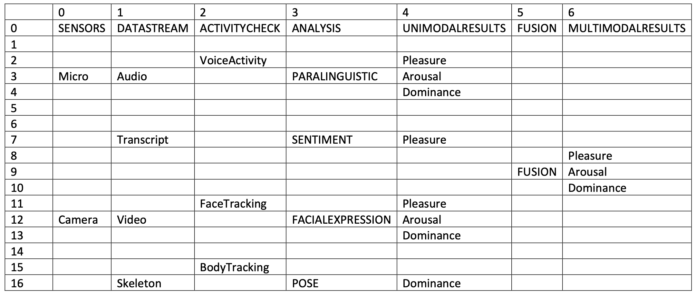

# The AffectToolbox: Affect Analysis for Everyone

## **Further Development Notes**

### **1. Cross-Platform Compatibility**
The graphical user interface is currently optimized for Windows. Some core dependencies (e.g., PyAudio) show limited or unstable behavior on macOS and Linux. Exploring cross-platform alternatives would significantly improve compatibility and broaden usability.

### **2. Proper Shutdown Mechanism**
Currently, closing the GUI window (e.g., via the “X” icon) only hides the interface, while background processes and threads continue to run.

An initial attempt to solve this issue was made by trying to delete all threads in the stop() method of the AffectPipeline.py file using del. However, this approach did not successfully terminate the running threads. The corresponding code is still present but remains ineffective.

A more robust shutdown mechanism is required to ensure that the application and all associated processes are fully and cleanly terminated.

---

## **Extending the GUI with New Buttons**

To integrate a new functional button into the graphical user interface, several internal lists must be updated accordingly. These lists are maintained in the buttons.py file.

The following lists must be extended:

- self.button_dependencies: List with dependencies of the buttons when activated.
  
- self.button_dependencies_visible: List with visible-dependencies of the buttons when activated.

- self.button_dependencies_deactivate: List with dependencies of the buttons when deactivated.

- self.header_to_buttons: List with the headings and their corresponding buttons.

- self.header_clicked: List with the headings and the buttons that should be visible when clicking.

To display the new button in the interface, it also needs to be added to the grid layout using grid_layout.addWidget(...) at the desired row and column.
The figure below illustrates the current layout and can serve as a guide when placing new buttons.

If connection lines between buttons are desired, these are typically handled automatically through the button_dependencies list. However, in special cases (such as the connections to the FUSION button), they must be manually defined in an list in the get_connections() method in buttons.py or in the straight_connections list in mainWindow.py, which is used for drawing vertical connection lines, such as those between the Audio and Transcript buttons.

When initializing a new button, it is recommended to follow the structure used in existing buttons. For example, a typical setup might look like:
self.SENTIMENT = CustomButton("SENTIMENT", self, main_window=self)
self.SENTIMENT.clicked.connect(lambda: self.toggle_button(self.SENTIMENT))
self.SENTIMENT.setVisible(False)
self.SENTIMENT.base_text = "SENTIMENT"

Make sure to:
- Use the appropriate button class (e.g., CustomButton, FloatButton, etc.) and refer to similar existing buttons for orientation,
  
- Connect the button to the toggle_button() method for proper activation handling,
  
- Set the button to invisible initially if needed (setVisible(False)),
  
- And define a base_text attribute, which is important for internal logic.
